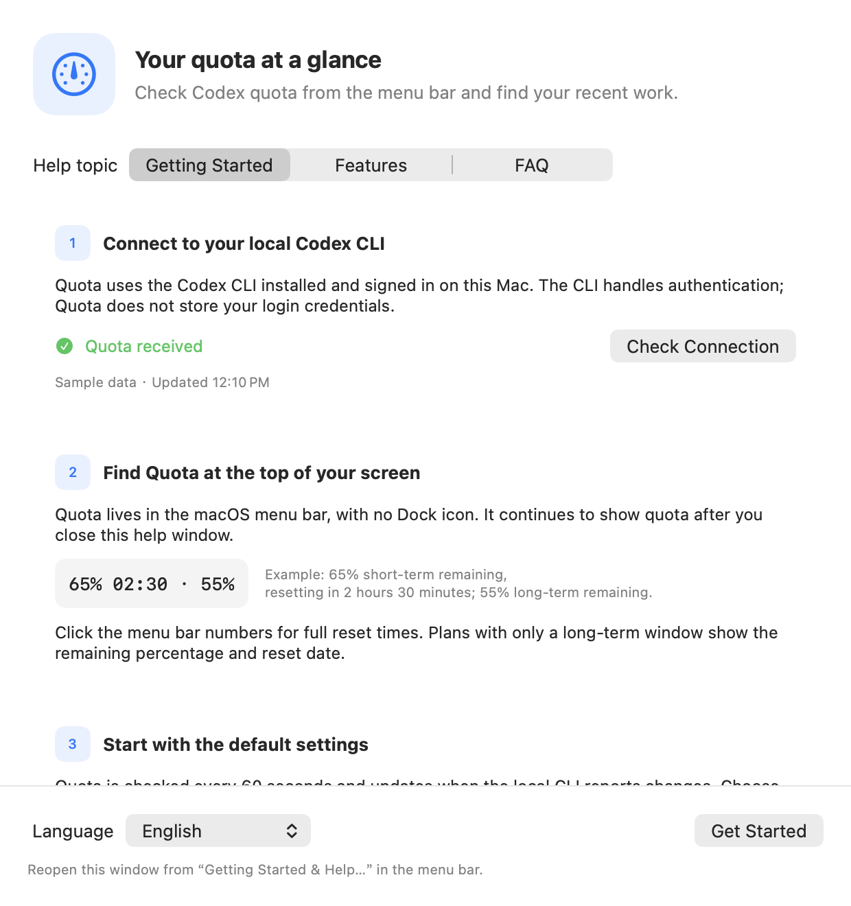
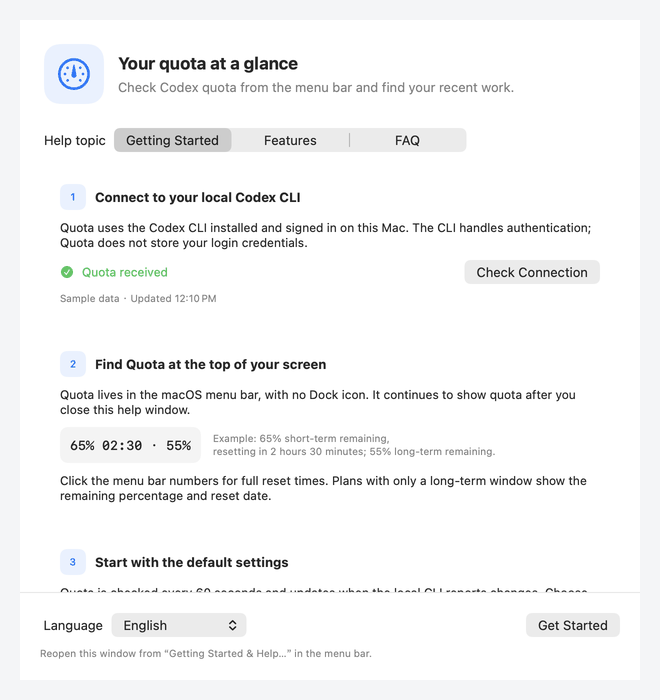

# Codex Quota Menu Bar

**English** | [简体中文](README.zh-CN.md)

A native menu bar app for macOS 13+ that shows your remaining Codex quota and reset times. It has no Dock icon or persistent main window. Click its menu bar item for details.

This is an unofficial community project and is not affiliated with OpenAI.

**Languages:** the app and documentation support English and Simplified Chinese. The app uses the first supported language in your system language preferences by default, falling back to English. Choose **Language → Follow System / 简体中文 / English** in the menu, or use the language picker in Help, to switch immediately; your choice is saved. Your session titles, task text, project paths, and messages from external services stay in their original language.

## Screenshots and short tour



[中文界面](docs/images/help-zh.png) · [About & Updates](docs/images/about-en.png)



Native app views rendered with synthetic data. The short tour cycles through English and Chinese help and version information; it contains no account or session data.

## Requirements

- macOS 13 or later.
- Codex CLI installed and signed in on the same Mac.
- Full Xcode to build from source. The Xcode project is included; XcodeGen is only needed to regenerate it.

## Download and install

Download the universal DMG from [GitHub Releases](https://github.com/xixiba-ai/codex-quota-menubar/releases). It includes Apple Silicon and Intel builds. Open the disk image and drag **Codex Quota.app** into **Applications**.

The current installer is a preview: **it has no Apple Developer ID signature and has not been notarized by Apple**. macOS may block the first launch. See the [installation guide](docs/INSTALL.en.md) for installation steps, system prompts, and SHA-256 verification. The first preview has not been tested on every supported macOS version and hardware configuration.

See the [maintenance guide](docs/HANDOFF.en.md) for project structure, local deployment, and maintenance checks. Run `./scripts/verify.sh` for routine verification.

## Getting started and help

A help window appears automatically on first launch. After that, open it from **新手引导与帮助…** (Getting Started & Help) in the menu bar menu.

- **快速上手** (Getting started): connection status and retry, a menu bar example, and default settings.
- **功能说明** (Features): quota reads versus scheduled requests, third-party reset forecasts, and session search and cleanup.
- **常见问题** (FAQ): CLI connectivity, quota display, scheduled activity, session lookup, and reopening help.

**检查连接** (Check connection) refreshes the displayed quota without starting a conversation task. Scheduled **自动刷新额度** sends real Codex requests, may consume a small amount of quota, and does not guarantee a quota reset.

## Build from source

The project uses XcodeGen for its project definition. If you have XcodeGen installed, run `xcodegen generate` before opening `CodexQuotaMenuBar.xcodeproj`. You can also use the included project directly:

```sh
./scripts/verify.sh

# Build the release configuration
xcodebuild -project CodexQuotaMenuBar.xcodeproj -scheme CodexQuotaMenuBar -configuration Release build
```

## Data sources and sessions

By default, the app connects to your locally authenticated Codex CLI through `codex app-server --stdio`, reads quota, and updates the menu bar when quota changes. The app does not read or store Codex/ChatGPT login credentials; the CLI handles authentication.

**定位 Codex 会话…** (Find Codex sessions) lists locally saved CLI and VS Code sessions. Search by title, initial task, project directory, or session ID, and filter by project or the last seven days. Select a session and choose **Resume in Terminal** to open macOS Terminal, enter the project folder, and run `codex resume` for that session. **Copy Resume Command** remains available as a fallback, and you can still open the project in Finder. Listing or selecting sessions does not resume, interrupt, or modify them; resuming starts only when you click the action.

The session panel also supports **终止并删除会话** (Stop and delete session) and bulk deletion by last activity, defaulting to sessions older than seven days. **Deletion permanently removes the session and its derived sessions and cannot be undone.** Bulk cleanup skips active sessions and asks for confirmation with the affected count.

The local app-server protocol is experimental. Codex CLI updates may require changes to this app. If your CLI is installed outside the default locations, configure its path:

```sh
defaults write com.example.CodexQuotaMenuBar codexExecutablePath "$HOME/.local/bin/codex"
```

To use your own authorized HTTPS quota service, set `usageEndpoint`. A configured endpoint takes precedence over the local CLI:

```sh
defaults write com.example.CodexQuotaMenuBar usageEndpoint 'https://your-authorized-service.example/usage'
defaults write com.example.CodexQuotaMenuBar usageEndpointBearerToken 'YOUR_TOKEN'
```

The endpoint must return JSON with ISO-8601 dates:

```json
{
  "shortTerm": { "remainingPercent": 65, "resetsAt": "2026-07-10T17:56:00Z" },
  "longTerm": { "remainingPercent": 55, "resetsAt": "2026-07-13T00:00:00Z" },
  "updatedAt": "2026-07-10T09:00:00Z",
  "sourceDescription": "Codex"
}
```

Remove `usageEndpoint` to return to the local CLI data source. The app checks quota every 60 seconds and also reacts to CLI quota updates. **立即刷新** (Refresh now) performs a manual check.

A failed read retains the previous values but marks them **stale** with a `⚠` in the menu bar. Data older than three minutes is also marked stale. The menu shows the age and full update date; successful reads or live updates restore the current status. Opening the menu refreshes these labels.

## Third-party reset forecasts

**重置概率预测** (Reset forecast) is a separate option, off by default. Enabling it immediately requests a forecast from [willcodexquotareset.com](https://www.willcodexquotareset.com/). Forecasts then refresh with active quota checks, including manual refresh, the 60-second check, scheduled activity, and quota-reset retries. Passive CLI quota notifications do not cause extra forecast requests.

The menu shows the service's reset probability over a 48-hour horizon, its update time, and the third-party source. Requests do not include Codex login credentials. Forecast failures do not affect quota reads; if a previous result exists, it is kept and marked as potentially stale. Disabling the option cancels an in-flight forecast request. These forecasts are estimates, not official reset commitments.

## Scheduled Codex requests

**自动刷新额度** toggles scheduled activity. The feature is off by default. Its default schedule sends a minimal local Codex CLI request at **05:30, 10:30, 15:30, and 20:30**, using local time. This runs independently from the quota reader and does not change its 60-second refresh interval.

Choose **修改触发时间…** (Edit Trigger Times) to enter one or more `HH:mm` 24-hour times, separated by English commas: `06:00, 12:30, 18:00`. Both languages use the same format; Chinese commas, enumeration commas, and empty entries are rejected. Existing saved schedules are preserved. Saving immediately reschedules the next trigger.

The menu shows the current state, last trigger, result (in progress, succeeded, or failed), trigger reason, and next scheduled trigger. Failures show a safe category such as CLI unavailable, timeout, or exhausted quota; any pending quota-reset retry has its own time. An interrupted request is marked as failed after relaunch, rather than left in progress. The app persists its setting, latest result, and handled time windows. On launch or wake after a missed schedule, it compensates for only the most recent missed window and does not repeat a handled window.

Scheduling checks, trigger reasons, results, and errors go to macOS Unified Logging under subsystem `com.example.CodexQuotaMenuBar`, category `AutoRefresh`. Error details are marked private.

## Version and updates

Open **About & Updates…** from the menu to see the installed release version, MIT license, and GitHub releases link. **Check for Updates** reads the public GitHub release list only when clicked, without Codex credentials or session data. Preview builds also check newer previews; stable builds check stable releases. New versions open their release page for manual download. This does not install updates automatically.

## License

[MIT License](LICENSE). The source and installer include the license.
